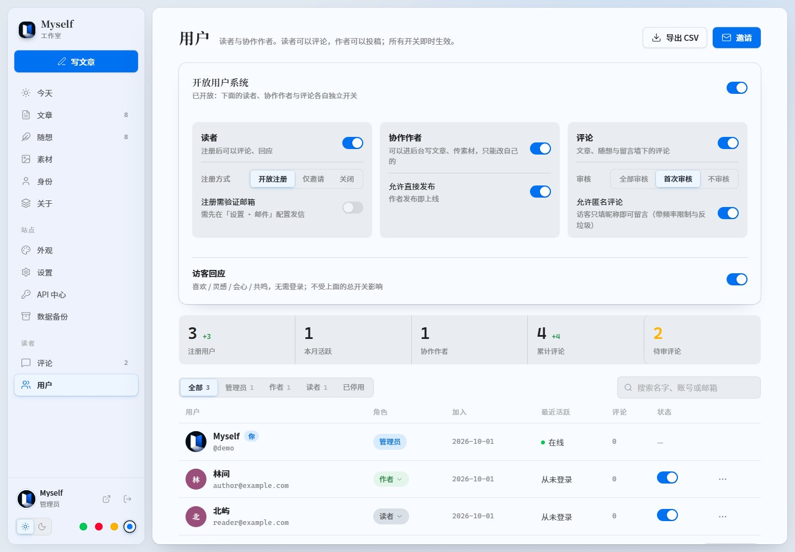
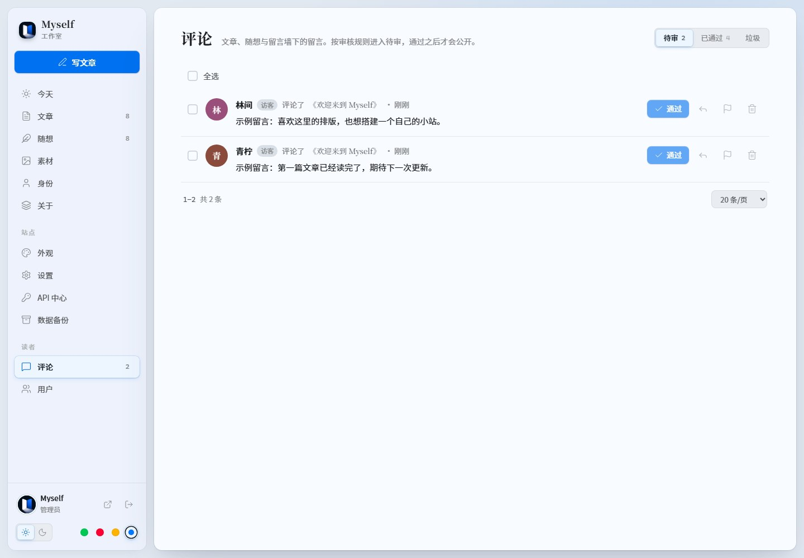
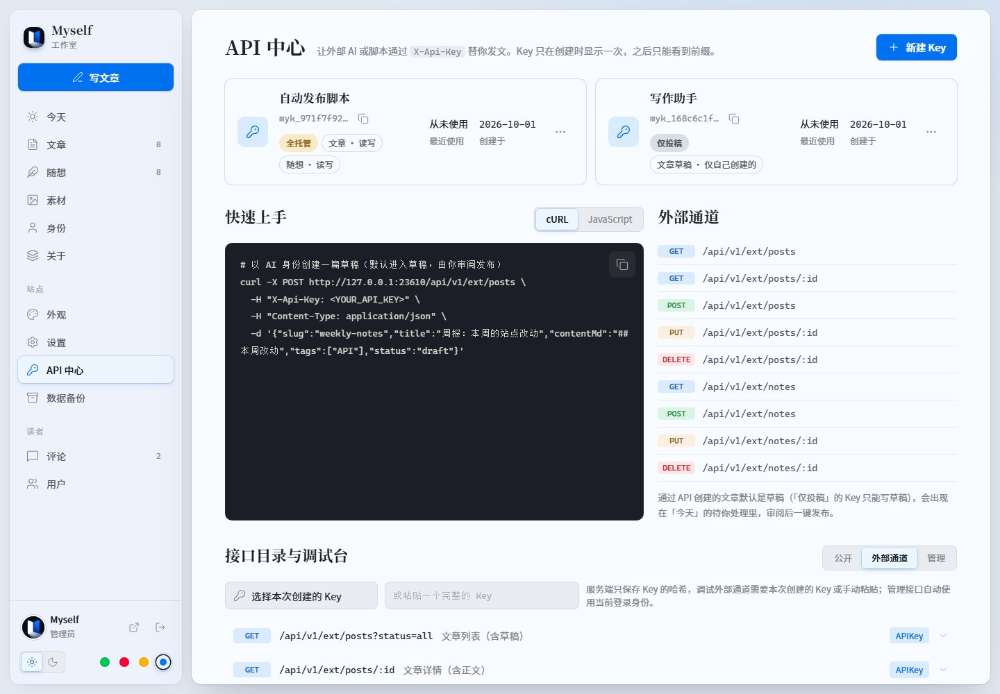
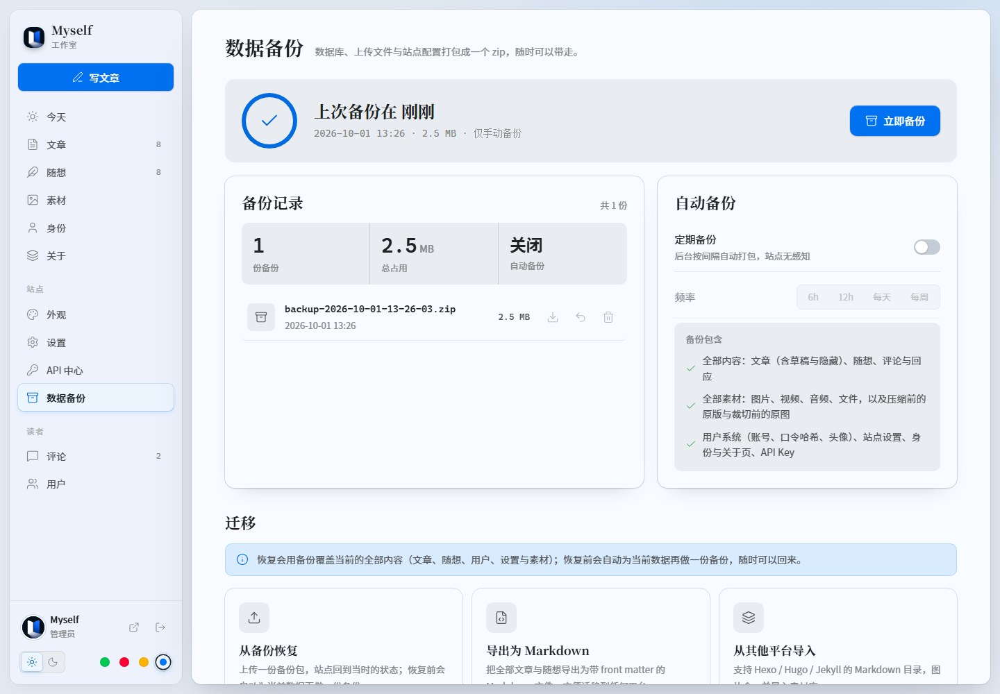
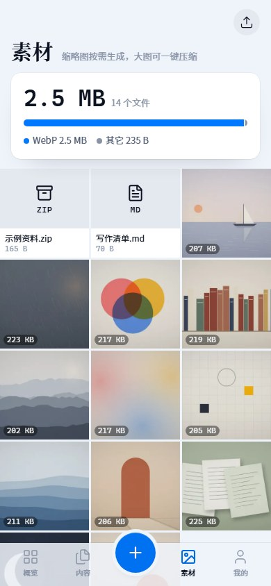
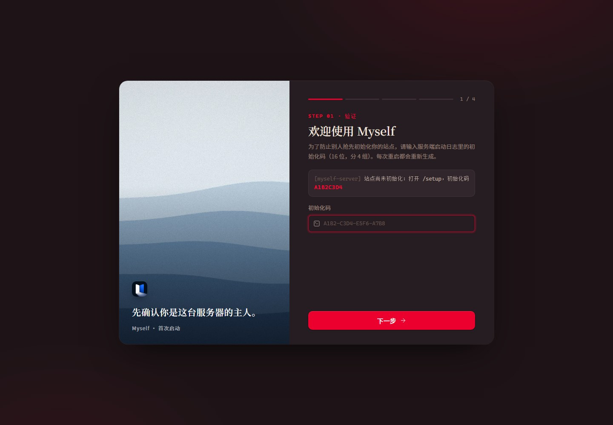
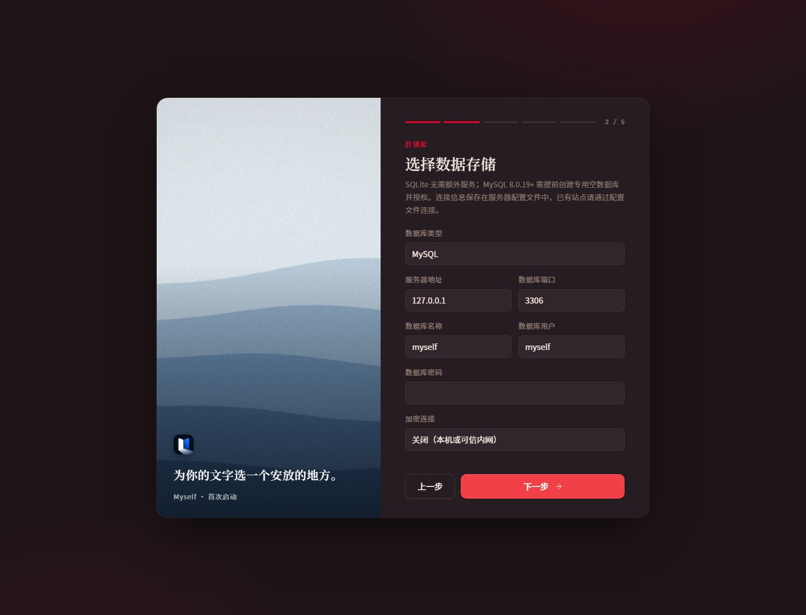
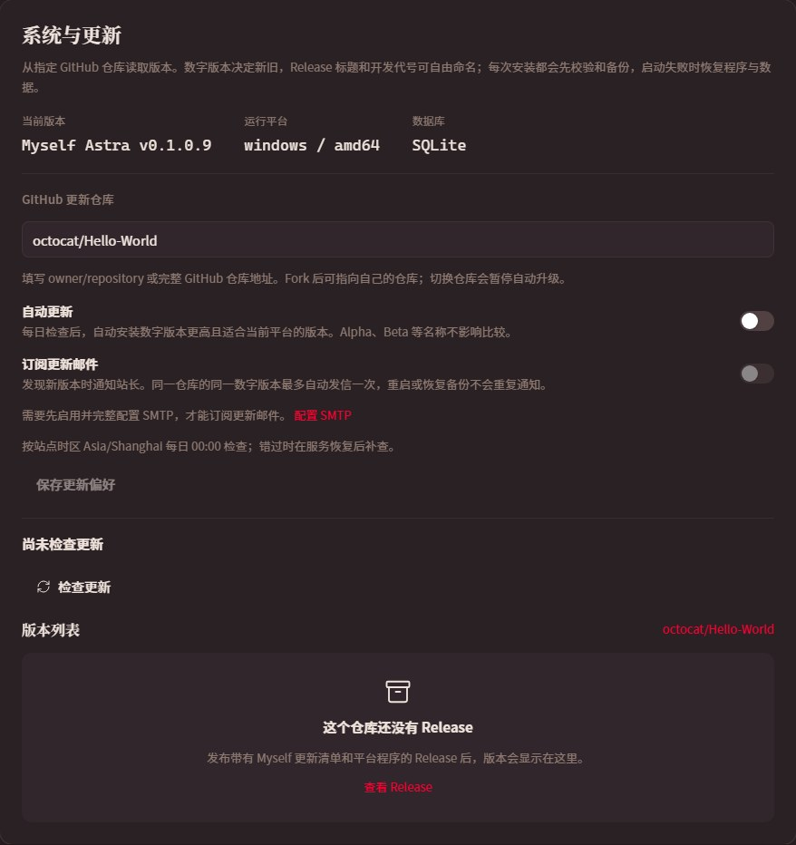

<p align="center"></p>
<h1 align="center">Myself</h1>
<p align="center">文章、随想，与一个人的数字花园。</p>
<p align="center"><strong>Vue 3 · TypeScript · Go · SQLite / MySQL · Markdown</strong></p>
<p align="center"><a href="#快速开始">快速开始</a> · <a href="#界面预览">界面预览</a> · <a href="docs/about-modules.md">26 种关于页模块</a> · <a href="#部署与升级">部署与升级</a> · <a href="#api-接入">API 接入</a></p>


Myself 是一个可自托管的个人博客引擎。用文章整理思考，用随想记录日常，用可编排的关于页介绍自己；写作、素材、读者互动与站点配置都在同一个 Studio 后台完成。

正文以 Markdown 保存，默认使用二进制内置的 SQLite，也可连接 MySQL。生产构建把前端嵌入 Go 可执行文件，同一个程序提供页面、API、素材和 RSS。默认运行无需 Node.js、系统 SQLite 或外置数据库，字体、图标和代码高亮资源随应用本地提供。

[下载 Release](https://github.com/BeaconCat/Myself/releases) · [查看构建与预览包](https://github.com/BeaconCat/Myself/actions/workflows/release.yml) · [部署说明](deploy/README.md)

**Myself Alpha · v0.0.1** 是首个公开预发布版本，采用 Apache License 2.0。适合自托管试用与反馈，后续版本仍会调整功能和数据结构；升级前请保留完整备份。[查看发行说明与下载](https://github.com/BeaconCat/Myself/releases/tag/v0.0.1)。

## 界面预览

截图来自独立演示环境，使用示例账号、文章和留言。GitHub 贡献图与活动记录使用模拟展示数据，不代表本仓库的实际统计；系统更新截图中的版本和仓库用于功能演示。点击图片可查看原图。

### 阅读与表达

| 深色首页 | 文章列表 |
| --- | --- |
| [](docs/screenshots/home-dark.jpg) | [](docs/screenshots/articles.jpg) |
| **文章阅读** | **随想** |
| [](docs/screenshots/article.jpg) | [](docs/screenshots/thoughts.jpg) |

### 写作与管理


| Studio 概览 | 素材与文件夹 |
| --- | --- |
| [](docs/screenshots/admin-dashboard.jpg) | [](docs/screenshots/admin-media.jpg) |
| **外观配置** | **关于页编排** |
| [](docs/screenshots/admin-appearance.jpg) | [](docs/screenshots/admin-about.jpg) |
| **用户与权限** | **评论审核** |
| [](docs/screenshots/admin-users.jpg) | [](docs/screenshots/admin-comments.jpg) |
| **API 中心** | **数据备份与迁移** |
| [](docs/screenshots/admin-api.jpg) | [](docs/screenshots/admin-backups.jpg) |

### 独立的移动界面

宽度不超过 767px 时启用移动外壳：前台提供悬浮底栏、抽屉和文章返回手势；后台提供底部导航、快捷创作、素材上传与移动写作。高级管理页面复用业务组件并提供窄屏布局，API 日志与用户列表在手机上以卡片展示。

<table>
<tr><th>首页</th><th>关于</th><th>素材</th></tr>
<tr><td></td><td></td><td></td></tr>
</table>

[移动文章列表](docs/screenshots/mobile-articles.jpg) · [移动写作](docs/screenshots/mobile-editor.jpg) · [关于页完整长图](docs/screenshots/about-full.jpg)

## 功能概览

| 领域 | 已实现能力 |
| --- | --- |
| 文章 | Markdown 存储、富文本与源码切换、草稿、立即/定时发布与撤回、摘要、标签、多封面、置顶、隐藏与批量操作 |
| 阅读 | 目录、阅读进度、代码高亮与复制、图片查看器、标签筛选、站内搜索、RSS |
| 随想 | 短内容、心情标签、配图、草稿与定时发布、独立详情与浏览量、日期筛选、返回列表保留位置 |
| 写作 | 表格、任务列表、图片尺寸与对齐、拼图、视频/音频/文件/压缩包嵌入、已保存草稿的自动保存 |
| 关于 | 26 种模块、12 栏布局、拖动排序与调宽、显示/隐藏、预览、集中维护身份 |
| 主题 | 深浅模式、四季色盘、自定义主色、简洁/卡片风格、圆角、路由动画档位、首页动效混搭 |
| 素材 | 图片、视频、音频与文件、内嵌封面/视频首帧预览、上传查重、原文件名、文件夹、搜索排序、多选打包、引用提示 |
| 图片 | 缩略图、裁切、压缩与回退、保留处理前原图 |
| 用户 | 站长/作者/读者、开放/邀请/关闭注册、资料与头像审核、密码重置、可选邮箱验证及 GitHub 登录 |
| 互动 | 访客回应、文章/随想评论、留言墙、审核与回复、垃圾标记 |
| API | 投稿与全托管 Key、接口目录、调试台、调用日志、即时吊销 |
| 数据 | 手动/定期备份、整站恢复、安全备份、Markdown 导出、Hexo/Hugo/Jekyll 导入 |
| 部署 | 内置 SQLite、可选 MySQL、运行配置模板、10 个系统/架构构建、后台检查更新、自动升级与启动失败回退 |

主题由**模式 × 色盘 × 风格**组成。站长可以设置默认值并决定访客是否可以切换风格；动画尊重系统“减弱动态效果”设置。当前界面语言为简体中文，文案集中在 i18n 字典中。

## 关于页模块


**[打开完整图鉴：全部 26 种模块的截图、用途、变体和宽度](docs/about-modules.md)。**

| 分组 | 模块 |
| --- | --- |
| 身份 | 身份区、在线状态、章节、社交、联系 |
| 数据 | 站点数字、GitHub、语言占比、技能刻度、年度回顾 |
| 经历 | 此刻、历程、作品、信条 |
| 喜好 | 书架、最近在听、语录、格言、画廊、足迹、喜好 |
| 工具 | 技能、技术栈、工作台 |
| 互动 | 问答、留言墙 |

模块在 12 栏网格中使用 1/3、2/3 或整行宽度，具体变体和可用宽度由注册表约束。可重复添加、隐藏和排序，不必展示所有模块。

“身份”页统一维护头像、名字、别名、签名、自述、状态、链接与格言；身份区和格言模块复用这些信息。站点数字读取真实内容统计，留言墙使用真实评论。语言占比支持手填或自动汇总指定 GitHub 账号所有公开原创仓库（排除 Fork），按代码字节数计算；技能、年度回顾、书架等由站长填写。GitHub 活跃度也支持手填和自动同步。“最近在听”展示手动填写的曲目及播放状态，并未接入音乐平台。

手机后台的关于页采用独立模块列表与单模块编辑界面，支持增删、上下排序、显隐、预览和保存，不套用桌面编排网格。

初始化不导入 Demo 时使用身份区、站点数字、格言三个模块。演示配置提供更完整的编排；图鉴额外加入独立社交模块，以覆盖全部 26 种类型。

## 快速开始

### 直接运行发行包

无需开发环境即可试用：从 [Myself Alpha](https://github.com/BeaconCat/Myself/releases/tag/v0.0.1) 下载对应系统的 `.zip` 或 `.tar.gz` 部署包，校验 `SHA256SUMS` 后解压，将 `config.example.json` 复制为 `config.json`。

- Linux / macOS：在解压目录执行 `./myself --config ./config.json`。
- Windows：在解压目录打开 PowerShell，执行 `.\myself.exe --config .\config.json`。

打开 **[http://localhost:3100](http://localhost:3100)**，使用终端输出的初始化码创建站长账号。默认内置 SQLite，数据保存在部署目录下的 `runtime/`；需要 MySQL 时可在初始化向导中选择。更多配置见 [部署说明](deploy/README.md)。

### 开发环境

- Go 1.26.7 或更新的受维护版本，版本依据见 [go.mod](server/go.mod)。
- Node.js 24，pnpm 10.x。
- SQLite 内置，无需安装数据库服务。

```bash
git clone https://github.com/BeaconCat/Myself.git
cd Myself
pnpm install --frozen-lockfile
pnpm -C client install --frozen-lockfile

# 首次先生成 Go 嵌入的前端目录
pnpm -C client build
pnpm dev
```

打开 **[http://localhost:5173](http://localhost:5173)**。后端默认位于 **[http://localhost:3100](http://localhost:3100)**，Vite 代理 `/api`、`/uploads` 和 `/feed`。根目录与前端有独立锁文件，两个安装步骤都需要执行。前端支持热更新，修改 Go 后需重启后端。

### 首次初始化

1. 在后端启动日志中找到一次性初始化码。
2. 打开站点，未初始化时进入 `/setup`。
3. 验证初始化码，选择当前数据库、SQLite 或 MySQL；选择数据库时会测试连接并保存运行配置。
4. 创建站长账号，填写站点与身份信息，选择是否导入演示内容。
5. 在后台继续配置身份、外观、关于页和用户功能。

没有默认管理员账号。初始化码只在服务端日志中显示，重启未初始化的服务会更换该码。初始化状态保存在数据库中。

<details>
<summary>查看初始化界面</summary>





</details>

## 部署与升级

前端通过 `go:embed` 直接从二进制提供，无需释放到磁盘。生产环境只需程序与持久化数据；运行时不需要 Node.js、pnpm 或 `node_modules`。

### 源码构建

安装步骤也可直接使用 [Release 部署包](https://github.com/BeaconCat/Myself/releases)。主分支的预览包位于 [Actions](https://github.com/BeaconCat/Myself/actions/workflows/release.yml)。

安装依赖后执行：

```bash
pnpm build
mkdir -p runtime
MYSELF_ROOT="$(pwd)/runtime" PORT=3100 ./server/bin/myself-server
```

Windows PowerShell：

```powershell
pnpm -C client build
go -C server build -tags nodynamic -o bin/myself-server.exe ./cmd/myself-server
$env:MYSELF_ROOT = Join-Path $PWD 'runtime'
$env:PORT = '3100'
.\server\bin\myself-server.exe
```

打开 **[http://localhost:3100](http://localhost:3100)**。前端先构建到 `server/web/dist`，再编入程序。

### 发行包与架构

选择对应系统和架构的 `.zip` 或 `.tar.gz`，校验 `SHA256SUMS` 后解压。包内包含：

```text
myself / myself.exe
config.example.json          # 默认内置 SQLite
config.mysql.example.json    # 可选 MySQL
runtime/data/
runtime/uploads/
runtime/backups/
LICENSE、NOTICE、THIRD_PARTY_LICENSES.txt、README.md
```

复制 `config.example.json` 为 `config.json`，运行 `./myself --config ./config.json`（Windows 为 `.\myself.exe --config .\config.json`），打开 `http://localhost:3100` 完成向导。也可以直接运行单独二进制，缺少配置文件时使用当前目录保存数据。

**全部发行目标都内置 SQLite 与前端资源，使用 `CGO_ENABLED=0`、`-tags nodynamic` 构建，不依赖外部 SQLite 或 WebP 动态库。** MySQL 仅在主动选择时需要外部服务。

| 系统 | x86 32 位 | x86-64 | ARM 32 位 | ARM64 | RISC-V64 |
| --- | --- | --- | --- | --- | --- |
| Windows | `windows-386` | `windows-amd64` | — | `windows-arm64` | — |
| macOS | — | `darwin-amd64` | — | `darwin-arm64` | — |
| Linux | `linux-386` | `linux-amd64` | `linux-arm` | `linux-arm64` | `linux-riscv64` |

`amd64` 同时适用于 Intel 与 AMD 的 x86-64 CPU。32 位 x86 使用 SSE2；Linux ARM 使用 ARMv6 基线，RISC-V64 使用 `rva20u64` 基线。破折号表示当前 Go 工具链不提供该组合。macOS 与 Windows 包未进行商业代码签名。

CI 会在原生 Windows/macOS、Linux x64 和其余 Linux 架构的 QEMU 环境中启动部署包，验证 SQLite 初始化、图片上传与 WebP 缩略图；另有真实程序替换和回退演练。

### 运行配置与 MySQL

配置文件选择顺序为 `--config` → `MYSELF_CONFIG` → 当前工作目录下的 `config.json`。相对数据根以配置文件目录为基准，`PORT` 和 `MYSELF_ROOT` 环境变量优先于文件。已有部署未提供配置文件时，仍保持原来的环境变量与当前目录行为。

```json
{
  "port": "3100",
  "root": "./runtime",
  "database": { "driver": "sqlite" },
  "updates": { "repository": "", "disabled": false }
}
```

MySQL 支持 **8.0.19 及以上**，建议使用受维护版本。先创建专用数据库和账户，再在初始化向导输入连接信息，或使用 [MySQL 配置模板](deploy/config.mysql.example.json)。不需要 cgo 或本地 MySQL 客户端程序。

```sql
CREATE DATABASE myself CHARACTER SET utf8mb4 COLLATE utf8mb4_0900_bin;
CREATE USER 'myself'@'localhost' IDENTIFIED BY '替换为强密码';
GRANT SELECT, INSERT, UPDATE, DELETE, CREATE, ALTER, INDEX ON myself.* TO 'myself'@'localhost';
```

账户主机范围按应用实际来源配置。`tls: "true"` 会验证服务器证书。运行配置保存数据库连接凭据，站点设置、内容和账户保存在选定数据库中；运行配置不会经站点 API 返回，也不会混入站点备份。

从 SQLite 切换到 MySQL：先下载完整备份，配置并连接专用 MySQL 空库，完成临时初始化，再恢复原备份。恢复后使用原站点账号登录，连接配置保持不变。反向迁移步骤相同，切换配置本身不会自动搬运数据。

### 持久化目录

默认数据根是**进程的当前工作目录**，不是二进制所在目录。生产环境请固定 `MYSELF_ROOT`：

```text
MYSELF_ROOT/
├── data/        # SQLite 数据库、站点配置与账户
├── uploads/     # 素材、保留的原图与缩略图
└── backups/     # 站点备份包
```

| 环境变量 | 作用 |
| --- | --- |
| `PORT` | 监听端口，默认 `3100` |
| `MYSELF_ROOT` | 数据根，默认当前工作目录 |
| `MYSELF_CONFIG` | 运行配置文件路径，可由 `--config` 覆盖 |
| `MYSELF_TRUST_PROXY` | 设为 `1` 后信任代理转发信息，用于客户端 IP 和 HTTPS 判断 |
| `MYSELF_UPDATE_TOKEN` | 可选 GitHub 读取凭据，用于私有仓库的版本检查与下载 |
| `MYSELF_DISABLE_SELF_UPDATE` | 设为 `1` 关闭自动替换程序，保留检查版本能力 |
| `VITE_API` | 开发代理目标，默认 `http://localhost:3100` |
| `HTTPS_PROXY` / `HTTP_PROXY` | GitHub 同步的出站代理，也可在后台配置 |

### 反向代理

公网部署可以通过 Nginx 等代理提供 HTTPS。以下为 Nginx `server` 块中的示例，域名与证书另行设置：

```nginx
location / {
    proxy_pass http://127.0.0.1:3100;
    proxy_set_header Host $http_host;
    proxy_set_header X-Forwarded-For $proxy_add_x_forwarded_for;
    proxy_set_header X-Forwarded-Proto $scheme;
}
```

保留浏览器 Host，使写请求的 Origin 校验一致。按素材大小设置代理的上传限制和超时。仅在可信代理后开启 `MYSELF_TRUST_PROXY=1`，并限制后端端口的直接公网访问。

在后台“设置 → 站点地址”填写正式 HTTPS 地址，供 RSS、邮件及 OAuth 使用。当前路由和资源地址按域名根路径部署设计。

### 备份与升级

先在后台创建并下载完整备份，然后停止服务，保存旧程序和数据目录，替换新程序，再用原来的数据根启动。程序启动时会执行数据库迁移；跨版本回退需配合相应数据备份。

完整备份包含数据库、站点配置、素材及保留的原图。恢复前自动生成安全备份，恢复成功后需重新登录。普通 ZIP 不能作为站点备份恢复。备份包含账户和配置数据，应存放在受控位置。

### 后台自动升级

在“设置 → 系统与更新”设置 `owner/repository` 或完整 GitHub 仓库地址。首次默认使用构建来源仓库，Fork 的 CI 产物会指向自己的 Fork；也可以通过后台修改。运行配置的 `updates.repository` 留空即使用构建来源，后台保存的更新偏好优先。

私有仓库可在同一页面配置 **GitHub Update Token**，保存后立即用于版本检查和下载，无需重启。Token 不会回显，留空保持原值，输入新值替换；清除后台保存值后回退到 `MYSELF_UPDATE_TOKEN` 环境变量（若有）。后台 Token 保存在数据根的私有 `.updates/preferences.json`，不进入公开站点配置或站点备份。

点击“检查更新”会按数字版本寻找更新，版本列表支持分页和指定版本安装，变更说明以 Markdown 展示。后台自动识别并显示服务器运行系统和架构，下载对应的程序。Release 标题与开发代号可自由命名，例如 `Myself Alpha v0.0.1`、`Myself Beta v0.0.2`、`Myself Astra v0.1.0.9`。比较时逐段比较数字，缺失段按零处理：`0.1.0.10 > 0.1.0.9`，`0.1 = 0.1.0.0`；名称和预发布标记不影响排序。

数字版本来自 `release-manifest.json`，不从 Release 标题猜测。无 Release 时显示空状态；没有更新清单、更新协议不兼容或缺少当前平台程序的版本会说明原因，不能自动安装。



下载清单与 SHA-256 校验完成后，程序还会核对数字版本、提交、开发代号和更新协议，再进入维护状态，等待已有请求结束并创建完整备份，随后替换程序、启动并检查数据库连接。目标版本启动失败时恢复切换前的程序和数据。版本列表可以选择升级、重新安装或回退到任一兼容版本；正常回退保留当前内容，回退操作会暂停自动升级，避免次日升回最新。

**自动更新**和**订阅更新邮件**是两个独立开关，默认关闭。按站点时区每天 00:00 检查，服务错过时间后会补查；开启时不立即触发检查。自动更新只安装数字版本更高且可用的程序。邮件订阅需要启用并完整配置 SMTP，以及有效的站长收件邮箱。

**更新通道**可选择“正式版”或“预览版（含正式版）”，版本列表、手动检查、自动更新和邮件订阅共同使用保存的通道。通道依据 GitHub Release 的 **Pre-release** 标记，不根据 Alpha/Beta 名称猜测；正式版通道排除预发布，预览版通道包含二者。新安装默认正式版；升级已有配置时保留原先包含预发布的范围，可手动切换。当前 Myself Alpha 属于预发布，需要选择预览版通道才能在列表中看到。切回正式版通道不会自动降级，相同数字版本也不会自动重装。

每次成功切换都会将原程序归档到数据根的 `.updates/history/<记录编号>/program.bak`。在“更新历史与回滚”分页查看保留的程序，并可直接回滚到本地备份，无需重新下载。默认保留 3 份，可选择 1、3、5、10 或 20 份；降低数量会清理多余的旧程序备份，不会删除 `backups/` 中的整站备份。回滚前仍会校验程序、创建整站备份，正常回滚保留最新内容，并暂停自动更新。

同一仓库的同一数字版本最多自动发信一次，去重记录写入数据根的 `.updates/notifications/`，跨重启、升级和站点备份恢复保留。为避免 SMTP 确认丢失造成重复，发送失败或中断也不会自动重试该版本，后台会显示结果。更新偏好和通知记录不包含在站点备份中。

执行用户需能写入程序目录、配置文件及数据根。Linux/macOS 通过 `exec` 保持服务主 PID，Windows 通过独立辅助进程在旧程序退出后替换。Windows 的第三方服务包装器可能会抢先重启进程，此类部署应关闭自动替换并由服务管理器执行更新。更新与重启日志位于数据根的 `.updates/`。

运行配置与素材不随二进制覆盖；突发断电或辅助进程被强制终止时，保留的整站备份可用于手动恢复。自动升级不执行数据库类型切换。持久化运行的开发构建可以手动安装发行版，安装带数字版本的发行构建后才能启用自动更新；通过 `go run` 启动的临时程序需先构建并运行正式文件。同一数字版本重新发布后，可在版本列表点击“重新安装”获取替换后的程序。

## 日常使用

### 写作与素材

从“写文章”进入编辑器，填写正文、封面、摘要、标签与链接，可切换 Markdown 源码。首次保存后，草稿自动保存后续修改。发布面板用于检查文章信息；文章可以撤回草稿或隐藏。隐藏内容不向前台列表、详情、RSS 和互动入口公开。

文章和随想共用完整 Markdown 排版，桌面及移动端编辑器均可切换富文本与源码。摘要里的手动换行会保留到首页、列表、详情、搜索、发布预览和 RSS。脚注使用 `[^source]` 引用与文末 `[^source]: 说明` 定义，阅读时可跳到脚注并返回原引用；重复引用复用同一编号，脚注续段缩进四个空格。

文章和随想均可选择立即发布或定时发布。时间选择器按站点时区显示；管理列表可查看和修改排期，取消定时会保留为草稿。排期保存在数据库中，服务恢复后会补发到期内容。随想信息流显示分钟、小时或日期，详情显示精确时间与自功能启用后累计的浏览数；短时间内同一访客的重复刷新会合并。

“设置 → 随想与封面”可独立控制随想中的别名和 `@用户名` 是否显示；`@用户名` 使用站长登录名，GitHub 账号仅用于 GitHub 相关模块。随想编辑器的工具栏默认收起，展开后插入工具独立成行；手机端也可设置排期并查看完整发布时间。

素材库支持文件夹、搜索、批量操作和引用提示。大图可压缩，处理前原图可供回退。图片、视频、音频和文件都可在编辑器插入。本站上传音频的正文卡片会显示文件内嵌封面，无封面时使用音乐图标；编辑器与阅读页使用相同呈现。

```markdown


@[video](/uploads/demo.mp4 "演示视频")

@[audio](/uploads/music.mp3 "音频")

@[file](/uploads/guide.pdf "使用说明")

@[archive](/uploads/materials.zip "资料包")

::: gallery layout=mosaic cols=3 ratio=4:3 gap=m


一组照片的图注。
:::
```

媒体块独占一行。拼图布局支持 `grid`、`mosaic`、`row`、`masonry`；ZIP 支持在线查看目录。

### 用户与互动

| 身份 | 范围 |
| --- | --- |
| 站长 `admin` | 全站内容、素材、身份、外观、用户、评论、API、备份和配置 |
| 作者 `author` | 自己的文章、写作及相应评论；可上传资源，素材管理页属于站长 |
| 读者 `reader` | 个人资料与允许的互动，不能进入 Studio |
| 访客 | 阅读与允许的回应；开启匿名评论后可留言 |

用户系统、读者注册、作者和评论可分别控制。注册支持开放、邀请、关闭；作者能否直接发布由设置决定。评论支持全部审核、首次审核或不审核，访客回应不依赖用户系统总开关。

在“我的账号”中，站长可随时修改自己的登录名，作者和读者每 30 天可修改一次；所有角色都需满足登录名格式与唯一性要求。

前台登录入口仅在用户系统开启且读者或作者至少一项开启时显示；只开启评论时不显示登录入口。站长仍可从后台登录地址进入。

邮箱验证、邮件找回密码及通知需要 SMTP。GitHub 登录需要 OAuth 应用和匹配的回调地址；后台设置提供入口。

### 内容迁移

“数据备份 → 迁移”可导入 Hexo、Hugo、Jekyll 内容目录或 ZIP，识别常见 YAML/TOML front matter，处理日期、标签、草稿、本地图片，并在导入前预览。也可导出带 front matter 的 Markdown，并选择携带素材。内容迁移和整站备份是不同用途。

## API 接入

在后台 API 中心创建 Key，供脚本或 AI 助手通过 HTTP 投稿，无需绑定特定模型服务。

| 权限 | 能力 |
| --- | --- |
| `contrib` 默认 | 创建文章草稿，只读写自己创建的草稿 |
| `full` | 读写全部文章和随想，可立即发布或定时发布 |

明文 Key 只显示一次，服务端保存哈希，吊销后立即失效。Key 用于 `/api/v1/ext/*`；后台管理接口使用站点会话。

```bash
export MYSELF_BASE_URL="http://localhost:3100"
export MYSELF_API_KEY="替换为自己创建的Key"
curl -X POST "$MYSELF_BASE_URL/api/v1/ext/posts" \
  -H "X-Api-Key: $MYSELF_API_KEY" \
  -H "Content-Type: application/json" \
  -d '{"slug":"hello-from-api","title":"第一篇 API 投稿","contentMd":"# 你好\n\n正文使用 Markdown。","tags":["API"],"status":"draft"}'
```

`slug` 为 1–80 位小写字母、数字和短横线，且不可重复。仅全托管 Key 可指定 `status: "published"` 或 `status: "scheduled"`；投稿 Key 创建的内容始终为草稿。

定时发布同时传入 `status: "scheduled"` 和未来的 `publishAt`，建议使用带时区偏移的 RFC 3339 时间，例如 `2027-01-01T09:00:00+08:00`。未带偏移的本地时间按站点时区解释。更新正文时省略 `status` 和 `publishAt` 会保留原有排期；传入 `status: "draft"` 可取消定时并保留内容。以接口返回的实际状态为准。

`PUT` 会更新整组内容字段：先读取详情，文章带回 `title`、`excerpt`、`contentMd`、`tags`、`covers`，随想带回 `contentMd`、`mood`、`images`，再合并修改与发布参数。仅传状态和时间会被拒绝，省略可选内容字段可能清空原值。新随想不传 `status` 会立即公开，准备草稿时必须显式传 `"draft"`。

| 方法 | 路径 | 说明 |
| --- | --- | --- |
| GET | `/api/v1/posts`、`/api/v1/posts/:slug` | 公开文章 |
| GET | `/api/v1/notes`、`/api/v1/notes/:id` | 公开随想 |
| GET | `/api/v1/tags`、`/api/v1/site-config` | 标签、公开配置 |
| GET | `/feed`、`/feed.xml` | RSS |
| GET / POST | `/api/v1/ext/posts` | 文章列表、创建 |
| GET / PUT / DELETE | `/api/v1/ext/posts/:id` | 文章读取、更新、删除 |
| GET / POST | `/api/v1/ext/notes` | 随想列表、创建 |
| GET / PUT / DELETE | `/api/v1/ext/notes/:id` | 随想读取、更新、删除 |

完整参数、示例、助手提示词、调用日志和响应调试见后台 API 中心。无效 Key 返回 `401`，权限不足返回 `403`，重复 slug 返回 `409`。

## 开发与项目结构

```text
client/src/
├── api/          # API 客户端与类型
├── about/        # 关于页注册表、模块、身份、兼容迁移
├── components/   # 公共、写作、前台、移动组件
├── router/       # 权限预判、桌面/移动视图映射
├── stores/       # 配置、主题、会话、加载、互动
├── styles/       # 主题 token 与动画
└── views/        # 前台、Studio、写作、移动页面
server/
├── cmd/myself-server/  # Go 入口
├── internal/
│   ├── auth/           # scrypt、JWT、初始化
│   ├── config/         # 站点配置与兼容读取
│   ├── httpapi/        # API、权限、素材、备份、互动
│   ├── imaging/        # 图片处理
│   ├── store/          # SQLite/MySQL、迁移、演示数据
│   └── updater/        # 版本检查、校验、替换与失败回退
└── web/               # 嵌入前端与 SPA 静态服务
.github/               # CI 与 Release 打包工具
docs/                  # 模块图鉴与截图
```

前端为 Vue SPA，后端使用标准库 `net/http`。SQLite、MySQL 驱动和发行包中的图片处理全部使用 Go。正式开发和生产使用 `server/`。

| 命令 | 用途 |
| --- | --- |
| `pnpm dev` | 同时启动 Vite 和 Go |
| `pnpm -C client build` | Vue/TypeScript 检查与前端构建 |
| `pnpm build` | 前端构建后编译 Go |
| `pnpm test` | Go 全量测试 |

新检出的仓库先构建前端，再运行 Go 测试，`go:embed` 需要 `server/web/dist` 存在。界面改动还应验证桌面/移动、深浅模式和色盘。

直接运行 Go 命令时使用 `go -C server test -tags nodynamic ./...`。Release 构建、触发方式、产物协议和本地验证见 [发布维护说明](.github/release/README.md)。

Markdown 入口是 [markdown.ts](client/src/utils/markdown.ts) 和 [embeds.ts](client/src/utils/embeds.ts)。新增关于模块需维护 [registry.ts](client/src/about/registry.ts)、组件映射和后台编辑器。默认配置和演示配置分开维护。

后端负责实际权限校验；浏览器会话的写请求带 `X-Requested-With: myself` 并校验同源 Origin。运行数据和构建产物不入库。更多约定见 [CLAUDE.md](CLAUDE.md) 和 [后端说明](server/README.md)。

## 常见问题

**Go 报 `pattern all:dist: no matching files found`？** 先执行 `pnpm -C client build`。

**Go 自动下载工具链时报 `checksum database disabled`？** 本项目要求 Go 1.26.7 或更新版本。若旧 Go 需要自动下载新工具链，须启用校验库（如 `GOSUMDB=sum.golang.org`）；也可直接安装符合要求的 Go。不要跳过下载校验。

**根目录安装依赖后前端仍缺包？** 还需执行 `pnpm -C client install --frozen-lockfile`。

**换启动方式后像是新站点？** 检查数据根。`pnpm dev` 后端的工作目录是 `server/`，直接运行程序时默认使用当前目录。生产应固定 `MYSELF_ROOT`。

**代理后的保存请求返回 403？** 检查 Host、Origin 和 `X-Requested-With`。仓库 Vite 代理使用 `changeOrigin: false`。

**邮件或 GitHub 登录入口不可用？** 检查功能开关、凭据和站点地址，对应外部服务也需可用。

## 许可证

采用 [Apache License 2.0](LICENSE)。第三方依赖、字体和品牌图标遵循各自许可证与使用约定。

[提交问题或功能建议](https://github.com/BeaconCat/Myself/issues)
