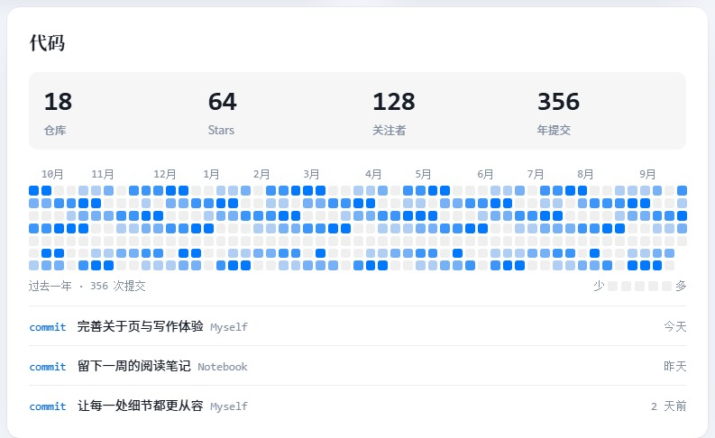
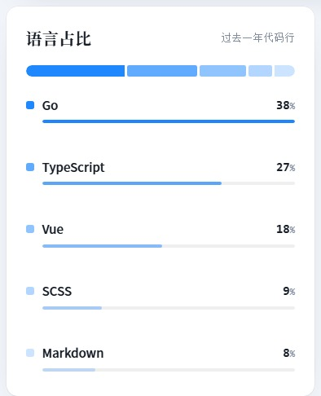
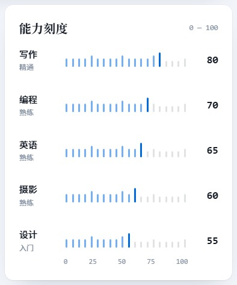
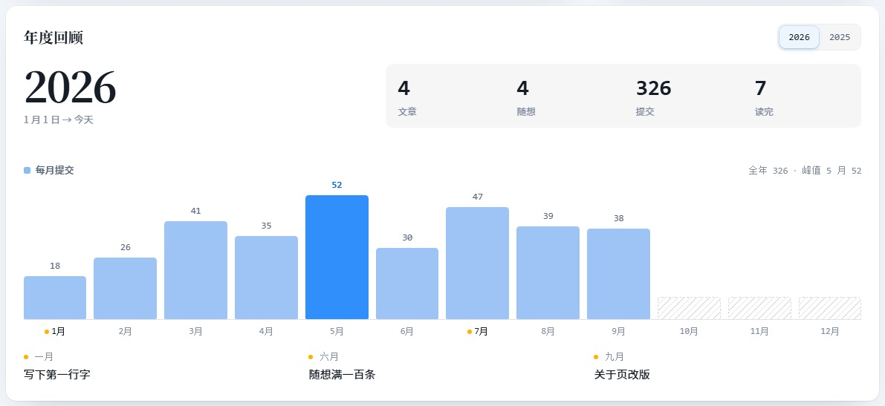
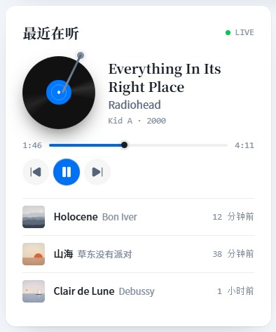
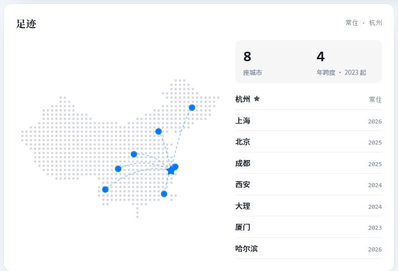
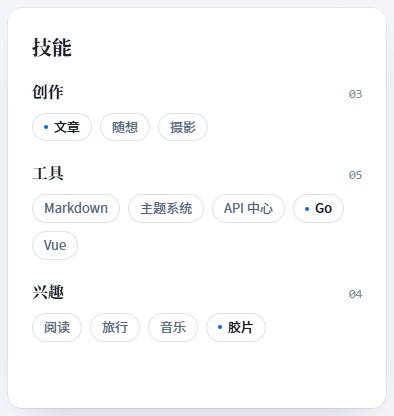
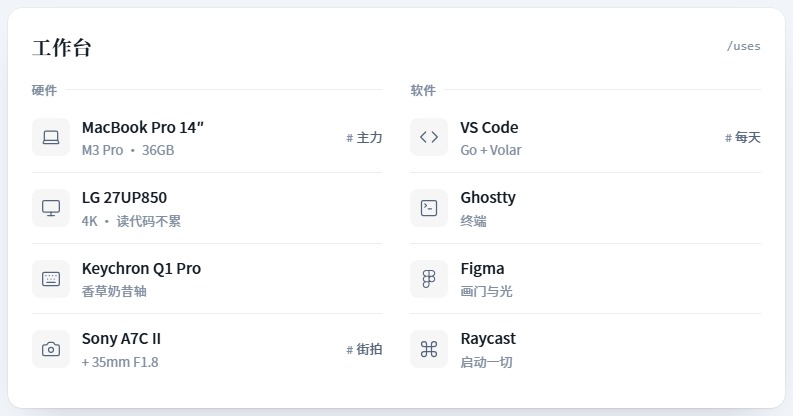

# 关于页模块图鉴

[返回项目首页](../README.md) · [完整页面长图](screenshots/about-full.jpg)

这里展示全部 26 种模块。截图来自独立演示环境，GitHub 活动使用模拟数据。宽度表示桌面网格中的占比；移动端会重排。每种类型展示一个实例，变体以文字列出。

身份区与格言读取集中维护的站点身份；站点数字读取真实统计，留言墙使用评论系统。其余展示数据主要由后台维护，GitHub 可配置同步。在线状态不是自动设备监测，“最近在听”也不是音乐平台连接。

## 身份

### 身份区

大字宋体名字、签名、自述、实时状态行与链接按钮；右侧形象图全尺寸显示、左缘渐隐。内容来自「身份」。

- 类型：`profile`
- 变体：形象图（`portrait`）、纯文字（`plain`）
- 宽度：整行

### 在线状态

此刻的状态：在线 / 专注 / 离开，附当前活动与最后活跃时间。

- 类型：`status`
- 变体：卡片（`card`）
- 宽度：1/3、2/3

### 章节

编辑式分隔：编号 + 宋体大标题 + 副题，把页面切成有节奏的段落。

- 类型：`chapter`
- 变体：细线（`rule`）
- 宽度：整行

### 社交

找到我：图标 + 名称 + handle，悬停箭头飞出；紧凑变体为胶囊行。

- 类型：`socials`
- 变体：列表（`list`）、胶囊（`pills`）
- 宽度：1/3、2/3

### 联系

CTA 卡：宋体大标题、邮箱一键复制、主按钮与回复时效。

- 类型：`contact`
- 变体：卡片（`card`）、通栏（`wide`）
- 宽度：1/3、2/3、整行

## 数据

### 站点数字

运行天数 / 文章 / 随想 / 标签，等宽数字滚动计数与本年进度。

- 类型：`stats`
- 变体：横排（`row`）、大号（`hero`）
- 宽度：1/3、2/3、整行

### GitHub

四项计数 + 贡献热力图 + 最近动态，数据来自设置中的 GitHub 配置。

- 类型：`github`
- 变体：热力图 + 动态（`full`）、仅热力图（`map`）
- 宽度：1/3、2/3、整行

### 语言占比

精致堆叠条 + 图例，悬停互相高亮；变体为环形图。

- 类型：`languages`
- 变体：堆叠条（`bar`）、环形（`ring`）
- 宽度：1/3、2/3

### 技能刻度

20 格刻度尺逐格点亮，末格发光，右侧数值与段位；变体为点阵。

- 类型：`skillbars`
- 变体：刻度尺（`ruler`）、点阵（`dots`）
- 宽度：1/3、2/3

### 年度回顾

按年切换：四个大数 + 12 个月柱状图 + 三条高光。

- 类型：`year`
- 变体：柱状（`chart`）
- 宽度：2/3、整行

## 经历

### 此刻

Now 页：在做 / 在学 / 在读 / 在玩，附注释、进度与更新时间。

- 类型：`now`
- 变体：列表（`list`）、两栏（`cols`）
- 宽度：1/3、2/3

### 历程

时间线：最新一条点亮；竖排适合窄栏，横排适合宽栏。

- 类型：`milestones`
- 变体：竖排（`vertical`）、横排（`horizontal`）
- 宽度：1/3、2/3、整行

### 作品

一大两小：精选项目大封面，其余横向卡；无图时用光影构图。

- 类型：`projects`
- 变体：一大两小（`feature`）
- 宽度：2/3、整行

### 信条

编号大字：宋体渐隐数字 + 一句信条 + 一行解释，开放排版。

- 类型：`principles`
- 变体：四列（`cols`）、大字竖排（`big`）
- 宽度：1/3、2/3、整行

## 喜好

### 书架

书脊视图：竖排书名、高矮不一，在读挂书签；点击抽出显示书卡。

- 类型：`bookshelf`
- 变体：书脊（`spine`）
- 宽度：1/3、2/3、整行

### 最近在听

黑胶唱片：播放时旋转、唱臂落下，进度实时走；宽版附最近曲目。

- 类型：`listening`
- 变体：黑胶（`vinyl`）
- 宽度：1/3、2/3

### 语录

轮播：宋体大引文模糊切入，分段进度可悬停暂停；列表变体保留旧版。

- 类型：`quotes`
- 变体：轮播（`rotator`）、列表（`list`）
- 宽度：1/3、2/3

### 格言

页尾收束：整行宋体大字逐字浮现，收尾装饰四选一（落款线 / 地平线 / 引号 / 无）；文字来自「身份」。

- 类型：`motto`
- 变体：收尾大字（`closing`）、卡片（`card`）
- 宽度：1/3、整行

### 画廊

不等宫格：首图 2×2，悬停浮出地点日期；点击从缩略图飞入大图。

- 类型：`gallery`
- 变体：拼贴（`mosaic`）、横滑（`strip`）
- 宽度：1/3、2/3、整行

### 足迹

点阵地图：城市发光脉冲，常住地为黄色，悬停与列表联动。

- 类型：`places`
- 变体：点阵（`map`）
- 宽度：1/3、2/3

### 喜好

分组 Tab 切换，条目带作者 / 年份 / 一句评语。

- 类型：`favorites`
- 变体：Tab（`tabs`）
- 宽度：1/3、2/3

## 工具

### 技能

三组键帽标签：按下有真实行程；每组可标一个主技能。

- 类型：`skills`
- 变体：键帽（`keys`）
- 宽度：1/3、2/3、整行

### 技术栈

等宽字母徽标 + 名称 + 角色，品牌色仅作淡底。

- 类型：`stack`
- 变体：网格（`grid`）
- 宽度：1/3、2/3、整行

### 工作台

/uses：硬件与软件分组，图标 + 名称 + 规格 + 标签（取代装备清单）。

- 类型：`uses`
- 变体：分组（`groups`）
- 宽度：1/3、2/3、整行

## 互动

### 问答

手风琴：高度平滑展开，加号旋转为减号；同时只展开一条。

- 类型：`faq`
- 变体：手风琴（`accordion`）
- 宽度：1/3、2/3、整行

### 留言墙

输入框、留言卡、站长回复与喜欢；审核后公开。

- 类型：`guestbook`
- 变体：墙（`wall`）
- 宽度：2/3、整行

